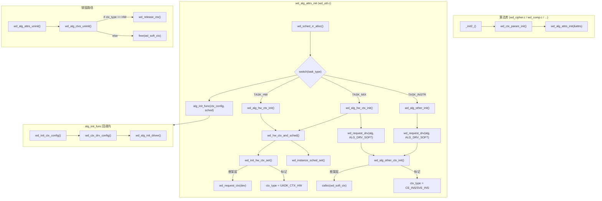
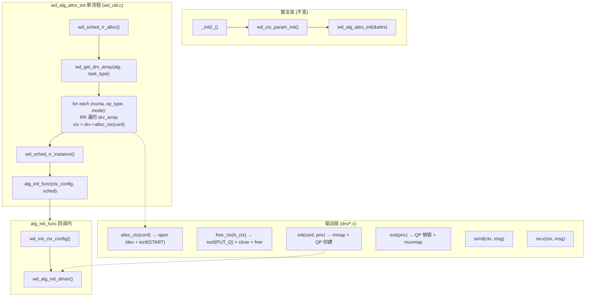
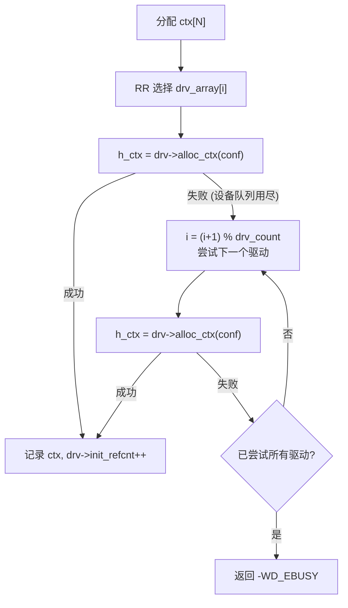
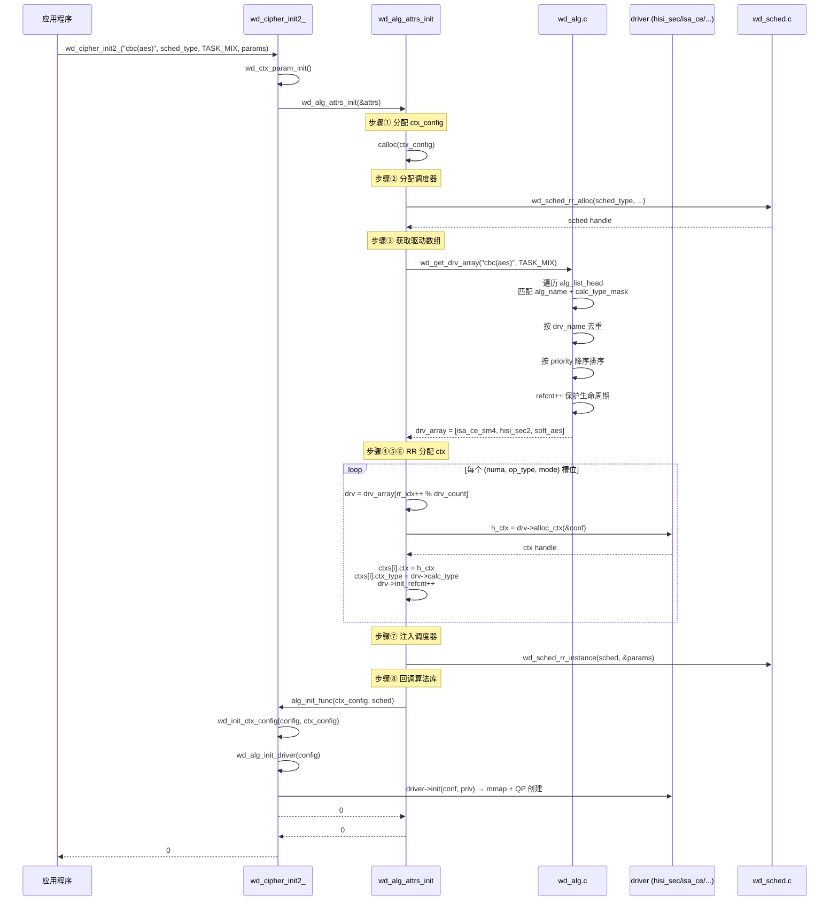
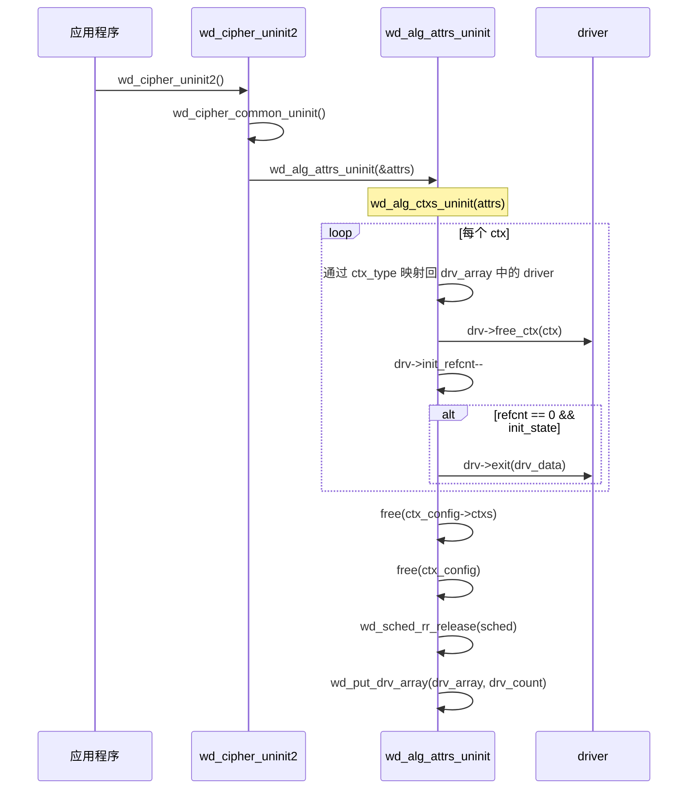

# UADK 框架层演进方案设计说明书

> 版本: v2.0  
> 日期: 2026-04-24  
> 基于: [uadk_fm.md](uadk_fm.md) 三方案 + `wd_alg_attrs_init` 统一入口重构

---

## 1. 现状架构与问题回顾

### 1.1 当前 `wd_alg_attrs_init` 三分支架构



**核心缺陷**：

1. **ctx 创建/销毁通过 `ctx_type` 分支判断**（`wd_init_hw_ctx_set:2873` / `wd_alg_ctxs_uninit:3135`），新增设备类型需修改框架层
2. **设备发现和 ctx 分配强耦合在框架层**（`wd_get_accel_list` + `wd_request_ctx`），新加速器无法复用
3. **驱动绑定在 ctx 创建之后才发生**（`wd_ctx_drv_config` 在 `alg_init_func` 回调中），排序不自然
4. **调度器按 `ctx_prop` 分组注册**，跨类型的负载分发能力有限
5. **`fallback` 机制嵌入驱动层**，调度器无法统一决策

### 1.2 当前数据流顺序

```
wd_cipher_init2_()
  ├─ wd_ctx_param_init()                    // 解析 ctx 数量配置
  ├─ wd_alg_attrs_init()                    // 框架层入口
  │    ├─ wd_sched_rr_alloc()               // ① 先分配调度器
  │    ├─ wd_alg_hw_ctx_init()              // ② 设备发现 + ctx 创建
  │    │    ├─ wd_get_accel_list()          //    扫描 /sys/class/uacce
  │    │    ├─ wd_init_hw_ctx_set()         //    wd_request_ctx + 设置 ctx_type=HW
  │    │    └─ wd_instance_sched_set()      //    注入调度器
  │    ├─ [TASK_MIX] wd_alg_other_ctx_init() // ③ 软算 ctx 创建
  │    │    └─ calloc(wd_soft_ctx)          //    框架层直接分配
  │    └─ alg_init_func(ctx_config, sched)  // ④ 回调算法库
  └─ wd_ctx_drv_config()                    // ⑤ 驱动绑定（太晚）
  └─ wd_alg_init_driver()                   // ⑥ 驱动 init → 创建 QP
```

**问题**：步骤②③是框架层硬编码创建 ctx，步骤⑤⑥才绑定驱动。排序不合理，且步骤②③因 `task_type` 走不同分支。

---

## 2. 新方案总体架构

### 2.1 设计原则

| 原则              | 说明                                                         |
| ----------------- | ------------------------------------------------------------ |
| **驱动归位**      | ctx 的创建/销毁全部通过 `driver->alloc_ctx()` / `driver->free_ctx()` 回调 |
| **入口统一**      | `TASK_HW` / `TASK_MIX` / `TASK_INSTR` 三个分支合并为一个统一驱动匹配+分配流程 |
| **RR 覆盖**       | ctx 在所有匹配驱动间轮询分配，实现业务到设备的均匀覆盖       |
| **引用计数**      | driver 的 `init`/`exit` 通过引用计数管理，首次 init、末次 exit |
| **fallback 废弃** | 驱动级 fallback 移除，统一由调度器做跨 ctx 分发决策          |
| **NUMA 保留**     | 通过 `ctx_params->bmp` 位图指定 NUMA 绑定                    |

### 2.2 新架构全景图



### 2.3 新旧关键差异对比

| 维度                 | 当前                                               | 新方案                                                  |
| -------------------- | -------------------------------------------------- | ------------------------------------------------------- |
| **设备发现**         | 框架层扫描 `/sys/class/uacce/`                     | 驱动层 `alloc_ctx` 内部封装                             |
| **驱动获取**         | 在 `alg_init_func` 回调中 `wd_ctx_drv_config` 绑定 | 在 `wd_alg_attrs_init` 入口通过 `wd_get_drv_array` 获取 |
| **ctx 创建**         | `wd_request_ctx(dev)` / `calloc(wd_soft_ctx)`      | `driver->alloc_ctx(conf)`                               |
| **ctx 销毁**         | `if (HW) wd_release_ctx() else free()`             | `driver->free_ctx(h_ctx)`                               |
| **task_type**        | 三路 `switch` 分支                                 | 统一为 `calc_type_mask` 筛选                            |
| **驱动绑定时机**     | ctx 创建之后，在回调中                             | ctx 创建时即绑定（通过 `attrs.drv_array`）              |
| **fallback**         | `driver->fallback` 驱动级降级                      | 废弃，调度器跨 ctx 分发                                 |
| **driver init 次数** | `init_state` 单次标记                              | 引用计数，首次 init、末次 exit                          |

---

## 3. 核心数据结构变更

### 3.1 `struct wd_alg_driver` 扩展

```c
// include/wd_alg.h (在现有定义末尾新增)
struct wd_alg_driver {
    const char  *drv_name;
    const char  *alg_name;
    int         priority;
    int         calc_type;
    int         queue_num;
    int         op_type_num;
    int         priv_size;
    int         *drv_data;
    handle_t    fallback;       // 【废弃】保留字段但不再使用
    int         init_state;     // 【保留】单次初始化标记
    int         init_refcnt;    // 【新增】引用计数，每次 alloc_ctx +1, free_ctx -1

    int (*init)(void *conf, void *priv);
    void (*exit)(void *priv);
    int (*send)(handle_t ctx, void *drv_msg);
    int (*recv)(handle_t ctx, void *drv_msg);
    int (*get_usage)(void *param);
    int (*get_extend_ops)(void *ops);

    // === 新增回调 ===
    handle_t (*alloc_ctx)(void *conf);   // 分配一个设备队列
    void (*free_ctx)(handle_t h_ctx);    // 释放一个设备队列
    bool need_lock;                      // 框架层是否需要为 ctx 加自旋锁
};
```

**字段说明**：

| 字段          | 类型                       | 说明                                                         |
| ------------- | -------------------------- | ------------------------------------------------------------ |
| `alloc_ctx`   | `handle_t (*)(void *conf)` | 分配队列：HW 驱动内 `open(/dev/xxx)` + `ioctl(START)`；软算驱动内 `calloc` + `spin_init` |
| `free_ctx`    | `void (*)(handle_t)`       | 释放队列：HW 驱动内 `ioctl(PUT_Q)` + `close` + `free`；软算驱动内 `spin_destroy` + `free` |
| `need_lock`   | `bool`                     | 是否需要框架层在 send/recv 时加自旋锁（替代 `wd_ctx_spin_lock` 的 `type != UADK_ALG_HW` 判断） |
| `init_refcnt` | `int`                      | 引用计数：每次 `alloc_ctx` 成功递增，`free_ctx` 递减；归零时调用 `exit()` 真实销毁 QP |

### 3.2 `struct wd_init_attrs` 扩展

```c
// include/wd_util.h (在现有定义末尾新增)
struct wd_init_attrs {
    __u32 sched_type;
    __u32 task_type;
    char alg[CRYPTO_MAX_ALG_NAME];
    struct wd_sched *sched;
    struct wd_ctx_params *ctx_params;
    struct wd_ctx_config *ctx_config;
    wd_alg_init alg_init;
    wd_alg_poll_ctx alg_poll_ctx;

    // === 新增字段 ===
    struct wd_alg_driver **drv_array;  // 驱动指针数组（去重后，RR 分配来源）
    __u32 drv_count;                   // 驱动数组长度
    __u32 drv_rr_index;                // 当前 RR 游标（分配 ctx 时递增）
};
```

### 3.3 新增公共实现文件

新增 `drv/wd_drv_common.h` 和 `drv/wd_drv_common.c`，提供两类公共 alloc/free 实现。

```c
// drv/wd_drv_common.h
#ifndef __WD_DRV_COMMON_H
#define __WD_DRV_COMMON_H

#include "wd.h"
#include "wd_alg.h"

#ifdef __cplusplus
extern "C" {
#endif

struct wd_ctx_conf {
    int numa_id;        // 期望的 NUMA 节点（-1 表示任意）
    __u8 ctx_mode;      // CTX_MODE_SYNC / CTX_MODE_ASYNC
    __u8 op_type;       // 操作类型索引
    void *drv_priv;     // 驱动私有数据（由驱动在 alloc_ctx 中填充）
};

/**
 * wd_drv_alloc_ctx() - UACCE 硬件队列分配
 * @conf: struct wd_ctx_conf *，包含 NUMA/mode/op_type
 *
 * 内部: 扫描 /sys/class/uacce 找匹配 drv_name 的设备
 *       → wd_request_ctx(dev) → wd_ctx_start(h_ctx)
 *       多个物理设备时内部 RR 选择
 *
 * Return: 队列句柄，失败返回 0。
 */
handle_t wd_drv_alloc_ctx(void *conf);

/**
 * wd_drv_free_ctx() - UACCE 硬件队列释放
 * @h_ctx: wd_drv_alloc_ctx 返回的句柄
 */
void wd_drv_free_ctx(handle_t h_ctx);

/**
 * wd_soft_alloc_ctx() - 软件指令队列分配
 * @conf: struct wd_ctx_conf *（忽略 numa_id）
 *
 * 内部: calloc(wd_soft_ctx) + spin_init(slock) + spin_init(rlock)
 */
handle_t wd_soft_alloc_ctx(void *conf);

/**
 * wd_soft_free_ctx() - 软件指令队列释放
 * @h_ctx: wd_soft_alloc_ctx 返回的句柄
 */
void wd_soft_free_ctx(handle_t h_ctx);

#ifdef __cplusplus
}
#endif
#endif /* __WD_DRV_COMMON_H */
```

```c
// drv/wd_drv_common.c 核心实现

handle_t wd_drv_alloc_ctx(void *conf)
{
    struct wd_ctx_conf *ctx_conf = (struct wd_ctx_conf *)conf;
    struct uacce_dev *dev;
    handle_t h_ctx;

    // 驱动内部扫描设备，按 NUMA 过滤
    dev = wd_find_dev_by_numa_internal(drv_dev_list,
                ctx_conf ? ctx_conf->numa_id : -1);
    if (!dev)
        return 0;

    h_ctx = wd_request_ctx(dev);        // open + alloc wd_ctx_h
    if (!h_ctx)
        return 0;

    if (wd_ctx_start(h_ctx)) {           // ioctl(UACCE_CMD_START)
        wd_release_ctx(h_ctx);
        return 0;
    }

    return h_ctx;
}

void wd_drv_free_ctx(handle_t h_ctx)
{
    if (!h_ctx)
        return;
    wd_release_ctx_force(h_ctx);         // ioctl(UACCE_CMD_PUT_Q)
    wd_release_ctx(h_ctx);               // close(fd) + free
}

handle_t wd_soft_alloc_ctx(void *conf)
{
    struct wd_soft_ctx *sctx;
    sctx = calloc(1, sizeof(struct wd_soft_ctx));
    if (!sctx)
        return 0;
    pthread_spin_init(&sctx->slock, PTHREAD_PROCESS_SHARED);
    pthread_spin_init(&sctx->rlock, PTHREAD_PROCESS_SHARED);
    return (handle_t)sctx;
}

void wd_soft_free_ctx(handle_t h_ctx)
{
    struct wd_soft_ctx *sctx = (struct wd_soft_ctx *)h_ctx;
    if (!sctx)
        return;
    pthread_spin_destroy(&sctx->slock);
    pthread_spin_destroy(&sctx->rlock);
    free(sctx);
}
```

### 3.4 驱动适配宏定义

以 `hisi_sec` 的 `GEN_SEC_ALG_DRIVER` 宏为例，改动量为 **+3 行**：

```c
// drv/hisi_sec.c (改动示意)

// 当前:
#define GEN_SEC_ALG_DRIVER(sec_alg_name, alg_type) { \
    .drv_name = "hisi_sec2",            \
    .calc_type = UADK_ALG_HW,          \
    .priority = 100,                    \
    .init = hisi_sec_init,             \
    .exit = hisi_sec_exit,             \
    .send = alg_type##_send,           \
    .recv = alg_type##_recv,           \
    .get_usage = hisi_sec_get_usage,   \
}

// 新方案:
#define GEN_SEC_ALG_DRIVER(sec_alg_name, alg_type) { \
    .drv_name = "hisi_sec2",            \
    .calc_type = UADK_ALG_HW,          \
    .priority = 100,                    \
    .alloc_ctx = wd_drv_alloc_ctx,     \  // +1
    .free_ctx  = wd_drv_free_ctx,      \  // +1
    .need_lock = true,                 \  // +1
    .init = hisi_sec_init,             \
    .exit = hisi_sec_exit,             \
    .send = alg_type##_send,           \
    .recv = alg_type##_recv,           \
    .get_usage = hisi_sec_get_usage,   \
}
```

各驱动适配汇总：

| 驱动         | 文件                    | `alloc_ctx`         | `free_ctx`         | `need_lock` |
| ------------ | ----------------------- | ------------------- | ------------------ | ----------- |
| `hisi_sec2`  | `drv/hisi_sec.c`        | `wd_drv_alloc_ctx`  | `wd_drv_free_ctx`  | `true`      |
| `hisi_zip`   | `drv/hisi_comp.c`       | `wd_drv_alloc_ctx`  | `wd_drv_free_ctx`  | `true`      |
| `hisi_hpre`  | `drv/hisi_hpre.c`       | `wd_drv_alloc_ctx`  | `wd_drv_free_ctx`  | `true`      |
| `hisi_dae`   | `drv/hisi_dae.c`        | `wd_drv_alloc_ctx`  | `wd_drv_free_ctx`  | `true`      |
| `hisi_udma`  | `drv/hisi_udma.c`       | `wd_drv_alloc_ctx`  | `wd_drv_free_ctx`  | `true`      |
| `isa_ce_sm3` | `drv/isa_ce_sm3.c`      | `wd_soft_alloc_ctx` | `wd_soft_free_ctx` | `false`     |
| `isa_ce_sm4` | `drv/isa_ce_sm4.c`      | `wd_soft_alloc_ctx` | `wd_soft_free_ctx` | `false`     |
| `hash_mb`    | `drv/hash_mb/hash_mb.c` | `wd_soft_alloc_ctx` | `wd_soft_free_ctx` | `false`     |

---

## 4. 关键接口设计

### 4.1 `wd_get_drv_array()` — 驱动匹配 + 去重

新增于 `wd_alg.c`，声明于 `include/wd_alg.h`。

```c
/**
 * wd_get_drv_array() - 获取去重后的匹配驱动数组
 * @alg_name:    算法名称 (如 "cbc(aes)", "sm3")
 * @task_type:   TASK_HW / TASK_MIX / TASK_INSTR
 * @drv_array:   输出：驱动指针数组（由框架释放）
 * @drv_count:   输出：数组长度
 *
 * 流程:
 *   1. 根据 task_type 计算 calc_type_mask
 *      TASK_HW    → UADK_ALG_HW
 *      TASK_INSTR → UADK_ALG_CE_INSTR | UADK_ALG_SVE_INSTR
 *      TASK_MIX   → UADK_ALG_HW | UADK_ALG_CE_INSTR | UADK_ALG_SVE_INSTR | UADK_ALG_SOFT
 *
 *   2. 遍历 alg_list_head 链表:
 *      - alg_name 匹配
 *      - calc_type 在 mask 内
 *      - available == true
 *      收集候选节点
 *
 *   3. 按 drv_name 去重（同类驱动只保留一个，取 priority 最高的）
 *
 *   4. 按 priority 降序排序（高优先级驱动先被 RR 到）
 *
 *   5. 每个去重后节点 refcnt++（生命周期保护）
 *
 * Return: 0 成功，负值为错误码。
 */
int wd_get_drv_array(const char *alg_name, __u32 task_type,
                     struct wd_alg_driver ***drv_array, __u32 *drv_count);

/**
 * wd_put_drv_array() - 释放驱动数组引用
 * @drv_array: wd_get_drv_array 返回的数组
 * @drv_count: 数组长度
 *
 * 对每个驱动调用 wd_release_drv() 递减引用计数。
 */
void wd_put_drv_array(struct wd_alg_driver **drv_array, __u32 drv_count);
```

**`task_type` → `calc_type_mask` 映射规则**：

```c
static inline __u32 task_type_to_calc_mask(__u32 task_type)
{
    switch (task_type) {
    case TASK_HW:
        return (1U << UADK_ALG_HW);
    case TASK_INSTR:
        return (1U << UADK_ALG_CE_INSTR) | (1U << UADK_ALG_SVE_INSTR);
    case TASK_MIX:
        return (1U << UADK_ALG_HW) | (1U << UADK_ALG_CE_INSTR) |
               (1U << UADK_ALG_SVE_INSTR) | (1U << UADK_ALG_SOFT);
    default:
        return 0;
    }
}
```

**去重流程示意图**：


### 4.2 `wd_alg_attrs_init()` — 统一入口重构

```c
// wd_util.c — 新实现

int wd_alg_attrs_init(struct wd_init_attrs *attrs)
{
    wd_alg_poll_ctx alg_poll_func = attrs->alg_poll_ctx;
    wd_alg_init alg_init_func = attrs->alg_init;
    struct wd_ctx_config *ctx_config = NULL;
    struct wd_alg_driver **drv_array = NULL;
    struct wd_sched *alg_sched = NULL;
    char *alg_name = attrs->alg;
    __u32 drv_count = 0;
    __u32 ctx_total = 0;
    __u32 op_type_num;
    int ret = 0;

    if (!attrs->ctx_params)
        return -WD_EINVAL;

    /* ───── 步骤 1: 分配 ctx_config ───── */
    ctx_config = calloc(1, sizeof(*ctx_config));
    if (!ctx_config)
        return -WD_ENOMEM;
    attrs->ctx_config = ctx_config;

    op_type_num = attrs->ctx_params->op_type_num;
    if (!op_type_num)
        goto out_ctx_config;

    /* ───── 步骤 2: 分配调度器 ───── */
    alg_sched = wd_sched_rr_alloc(attrs->sched_type, op_type_num,
                    attrs->sched_type == SCHED_POLICY_DEV
                        ? DEVICE_REGION_MAX
                        : numa_max_node() + 1,
                    alg_poll_func);
    if (!alg_sched)
        goto out_ctx_config;
    attrs->sched = alg_sched;

    /* ───── 步骤 3: 获取匹配驱动数组（去重、排序） ───── */
    ret = wd_get_drv_array(alg_name, attrs->task_type, &drv_array, &drv_count);
    if (ret || drv_count == 0) {
        WD_ERR("no driver found for %s task_type=%d\n", alg_name, attrs->task_type);
        if (!ret) ret = -WD_ENODEV;
        goto out_freesched;
    }
    attrs->drv_array = drv_array;
    attrs->drv_count = drv_count;
    attrs->drv_rr_index = 0;

    /* ───── 步骤 4: 计算 ctx 总数（新算法：不再乘 numa_cnt） ───── */
    ctx_total = wd_ctxs_total_calc(attrs);
    if (!ctx_total)
        goto out_put_drv;
    ctx_config->ctx_num = ctx_total;

    /* ───── 步骤 5: 分配 ctxs 数组 ───── */
    ctx_config->ctxs = calloc(ctx_total, sizeof(struct wd_ctx));
    if (!ctx_config->ctxs)
        goto out_put_drv;

    /* ───── 步骤 6: 统一 ctx 分配（RR 驱动 + NUMA 感知） ───── */
    ret = wd_ctxs_unified_alloc(attrs);
    if (ret)
        goto out_free_ctxs;

    /* ───── 步骤 7: ctx 注入调度器 ───── */
    ret = wd_ctxs_sched_instance(attrs);
    if (ret)
        goto out_ctxs_free;

    /* ───── 步骤 8: 回调算法库 init ───── */
    ctx_config->cap = attrs->ctx_params->cap;
    ret = alg_init_func(ctx_config, alg_sched);
    if (ret)
        goto out_ctxs_free;

    return 0;

out_ctxs_free:
    wd_ctxs_unified_free(attrs);
out_free_ctxs:
    free(ctx_config->ctxs);
    ctx_config->ctxs = NULL;
out_put_drv:
    wd_put_drv_array(drv_array, drv_count);
out_freesched:
    wd_sched_rr_release(alg_sched);
out_ctx_config:
    free(ctx_config);
    return ret;
}
```

### 4.3 `wd_ctxs_unified_alloc()` — 核心 RR 分配逻辑

```c
/**
 * wd_ctxs_unified_alloc() - 遍历所有 ctx 槽位，RR 选择驱动，调用 alloc_ctx
 *
 * 分配策略:
 *   外层: 遍历 NUMA 节点 (根据 bmp 位图)
 *   中层: 遍历 op_type (0..op_type_num-1)
 *   内层: 遍历 ctx_mode (SYNC, ASYNC), ctx 计数
 *      → 每个槽位: drv = drv_array[rr_idx++ % drv_count]
 *      → ctx = drv->alloc_ctx(&ctx_conf)
 *      → 记录 ctx 的 op_type / ctx_mode / ctx_type(=drv->calc_type) / drv 引用
 */
static int wd_ctxs_unified_alloc(struct wd_init_attrs *attrs)
{
    struct wd_ctx_config *ctx_config = attrs->ctx_config;
    struct wd_ctx_params *ctx_params = attrs->ctx_params;
    struct wd_alg_driver **drv_array = attrs->drv_array;
    __u32 drv_count = attrs->drv_count;
    struct bitmask *bmp = ctx_params->bmp;
    __u32 op_type_num = ctx_params->op_type_num;
    __u32 ctx_idx = 0;
    int numa_id, op_type, mode;

    // 获取 NUMA 节点列表（从 bmp 位图）
    int *numa_nodes = wd_bmp_to_numa_list(bmp);  // 新增工具函数
    int numa_cnt = bmp ? numa_bitmask_weight(bmp) : 1;

    for (int ni = 0; ni < numa_cnt; ni++) {
        numa_id = numa_nodes ? numa_nodes[ni] : 0;

        for (op_type = 0; op_type < (int)op_type_num; op_type++) {
            struct wd_ctx_nums *ctx_nums = &ctx_params->ctx_set_num[op_type];

            for (mode = CTX_MODE_SYNC; mode < CTX_MODE_MAX; mode++) {
                __u32 count = (mode == CTX_MODE_SYNC)
                              ? ctx_nums->sync_ctx_num
                              : ctx_nums->async_ctx_num;

                for (__u32 k = 0; k < count; k++, ctx_idx++) {
                    // RR 选择驱动
                    struct wd_alg_driver *drv =
                        drv_array[(attrs->drv_rr_index++) % drv_count];

                    // 准备 alloc_ctx 的配置
                    struct wd_ctx_conf conf = {
                        .numa_id  = numa_id,
                        .ctx_mode = mode,
                        .op_type  = op_type,
                    };

                    // 通过驱动创建 ctx
                    handle_t h_ctx = drv->alloc_ctx(&conf);
                    if (!h_ctx) {
                        // 设备队列用尽 → 尝试下一个驱动
                        // （符合"自然溢出"设计）
                        bool success = false;
                        for (__u32 fallback = 1; fallback < drv_count; fallback++) {
                            drv = drv_array[(attrs->drv_rr_index++) % drv_count];
                            h_ctx = drv->alloc_ctx(&conf);
                            if (h_ctx) {
                                success = true;
                                break;
                            }
                        }
                        if (!success) {
                            WD_ERR("all drivers exhausted at ctx_idx=%u\n", ctx_idx);
                            return -WD_EBUSY;
                        }
                    }

                    // 填充 ctx 元数据
                    ctx_config->ctxs[ctx_idx].ctx      = h_ctx;
                    ctx_config->ctxs[ctx_idx].op_type  = op_type;
                    ctx_config->ctxs[ctx_idx].ctx_mode = mode;
                    ctx_config->ctxs[ctx_idx].ctx_type = drv->calc_type;

                    // 驱动引用计数 +1（用于延迟 init / 引用计数销毁）
                    drv->init_refcnt++;
                }
            }
        }
    }

    return 0;
}
```

**溢出处理流程图**：



### 4.4 `wd_alg_attrs_uninit()` — 统一销毁路径

```c
void wd_alg_attrs_uninit(struct wd_init_attrs *attrs)
{
    struct wd_ctx_config *ctx_config = attrs->ctx_config;
    struct wd_sched *alg_sched = attrs->sched;

    if (!ctx_config) {
        wd_sched_rr_release(alg_sched);
        return;
    }

    wd_alg_ctxs_uninit(attrs);    // 【重构】统一通过 driver->free_ctx
    free(ctx_config);
    wd_sched_rr_release(alg_sched);
    wd_put_drv_array(attrs->drv_array, attrs->drv_count);
}

static void wd_alg_ctxs_uninit(struct wd_init_attrs *attrs)
{
    struct wd_ctx_config *ctx_config = attrs->ctx_config;
    struct wd_alg_driver **drv_array = attrs->drv_array;
    __u32 drv_count = attrs->drv_count;
    __u32 i;

    for (i = 0; i < ctx_config->ctx_num; i++) {
        if (!ctx_config->ctxs[i].ctx)
            continue;

        // 通过 ctx_type 映射回 driver（ctx_type 保存了 calc_type）
        struct wd_alg_driver *drv = NULL;
        __u8 calc_type = ctx_config->ctxs[i].ctx_type;
        for (__u32 j = 0; j < drv_count; j++) {
            if (drv_array[j]->calc_type == calc_type) {
                drv = drv_array[j];
                break;
            }
        }

        if (drv) {
            drv->free_ctx(ctx_config->ctxs[i].ctx);
            drv->init_refcnt--;
            // 引用计数归零 → 真实销毁
            if (drv->init_refcnt == 0 && drv->init_state)
                drv->exit(drv->drv_data);
        }
        ctx_config->ctxs[i].ctx = 0;
    }

    if (ctx_config->ctxs) {
        free(ctx_config->ctxs);
        ctx_config->ctxs = NULL;
    }
}
```

### 4.5 `wd_alg_init_driver()` — 引用计数驱动的 init

```c
int wd_alg_init_driver(struct wd_ctx_config_internal *config)
{
    __u32 i, j;
    int ret;

    for (i = 0; i < config->ctx_num; i++) {
        struct wd_ctx_internal *ctx = &config->ctxs[i];
        struct wd_alg_driver *drv = ctx->drv;

        if (!ctx->ctx || !drv)
            continue;

        // 通过引用计数判断是否需要 init
        if (drv->init_state)
            continue;   // 已经初始化过

        if (!drv->priv_size) {
            WD_ERR("invalid: driver priv ctx size is zero!\n");
            return -WD_EINVAL;
        }

        void *priv = calloc(1, drv->priv_size);
        if (!priv)
            return -WD_ENOMEM;

        ret = drv->init(config, priv);
        if (ret) {
            free(priv);
            goto init_err;
        }

        drv->drv_data = priv;
        drv->init_state = 1;
    }

    return 0;

init_err:
    for (j = 0; j < i; j++)
        wd_ctx_uninit_driver(config, &config->ctxs[j]);
    return ret;
}
```

### 4.6 `wd_ctx_spin_lock` 泛化

```c
// wd_internal.h — 从硬编码 type 判断 变为 查询 driver 字段

static inline void wd_ctx_spin_lock(struct wd_ctx_internal *ctx)
{
    if (!ctx->drv || !ctx->drv->need_lock)
        return;
    pthread_spin_lock(&ctx->lock);
}

static inline void wd_ctx_spin_unlock(struct wd_ctx_internal *ctx)
{
    if (!ctx->drv || !ctx->drv->need_lock)
        return;
    pthread_spin_unlock(&ctx->lock);
}
```

---

## 5. 完整调用流程

### 5.1 初始化流程（新）



### 5.2 销毁流程（新）



### 5.3 运行时 send/recv（不变）

```
应用程序
  → wd_cipher_request(ctx, msg)
    → wd_ctx_spin_lock(ctx_internal)     // 【重构】通过 drv->need_lock 判断
    → driver->send(ctx, drv_msg)         // 不变
    → wd_ctx_spin_unlock(ctx_internal)
    → [异步] scheduler poll → driver->recv(ctx, drv_msg)  // 不变
```

---

## 6. 调度器关系说明

### 6.1 当前与新方案的职责划分

```
┌─────────────────────────────────────────────────────────┐
│                    应用层 (Application)                  │
│  wd_cipher_request / wd_comp_request / ...              │
├─────────────────────────────────────────────────────────┤
│                 算法库 (libwd_crypto / libwd_comp)       │
│  ── 不变：op_type 路由、异步请求池管理                    │
├─────────────────────────────────────────────────────────┤
│              框架层 (libwd / wd_util.c)                  │
│  【重构】                                                │
│  - wd_get_drv_array()   驱动匹配+去重                    │
│  - wd_ctxs_unified_alloc()  RR 分配 ctx                 │
│  - wd_alg_ctxs_uninit()  统一销毁 via driver->free_ctx  │
├─────────────────────────────────────────────────────────┤
│                 调度器 (wd_sched.c)                      │
│  ── 接口不变：wd_sched_rr_instance / wd_sched_rr_alloc   │
│  ── 内部：支持 hash 桶 + 负载感知算法（已有分支版本）     │
├─────────────────────────────────────────────────────────┤
│                 驱动层 (drv/*.c)                         │
│  【扩展】                                                │
│  + alloc_ctx / free_ctx                                 │
│  + need_lock                                            │
│  + init_refcnt（替换 init_state 单次标记）                │
└─────────────────────────────────────────────────────────┘
```

### 6.2 `ctx_type` 的保留语义

| 字段                              | 旧用途                                             | 新用途                                                       |
| --------------------------------- | -------------------------------------------------- | ------------------------------------------------------------ |
| `struct wd_ctx.ctx_type`          | 生命周期路由（`if HW → wd_release_ctx else free`） | **调度 hint**（调度器用于负载感知决策）+ **销毁时映射回 driver** |
| `struct wd_ctx_internal.ctx_type` | 同上                                               | 同上                                                         |

销毁时通过 `ctx_type` 在 `drv_array` 中找到对应的 `calc_type` 匹配的 driver，不再需要 `if/else` 分支。

---

## 7. 移除的函数与代码

### 7.1 删除的函数

| 函数                      | 文件             | 原因                                  |
| ------------------------- | ---------------- | ------------------------------------- |
| `wd_alg_other_init()`     | `wd_util.c:3035` | 功能被 `wd_ctxs_unified_alloc` 吸收   |
| `wd_init_hw_ctx_set()`    | `wd_util.c:2829` | 替换为 `driver->alloc_ctx` 调用       |
| `wd_alg_other_ctx_init()` | `wd_util.c:2967` | 替换为 `driver->alloc_ctx` 调用       |
| `wd_alg_drv_bind()`       | `wd_util.c:2620` | 驱动绑定在 `wd_get_drv_array` 时完成  |
| `wd_alg_drv_unbind()`     | `wd_util.c:2673` | 替换为 `wd_put_drv_array`             |
| `wd_ctx_drv_config()`     | `wd_util.c:2754` | 不再需要在 `alg_init_func` 回调中绑定 |
| `wd_ctx_drv_deconfig()`   | `wd_util.c:2744` | 同上                                  |

### 7.2 删除的结构体字段

| 字段       | 所在结构体             | 原因                            |
| ---------- | ---------------------- | ------------------------------- |
| `fallback` | `struct wd_alg_driver` | 调度器跨 ctx 分发替代驱动内降级 |

---

## 8. 算法库 init 回调简化

**当前** `wd_cipher_init2_` 中 `wd_alg_attrs_init` 之后还需：

```c
// 当前
ret = wd_alg_attrs_init(&wd_cipher_init_attrs);  // ① 框架分配 ctx
// ...
ret = wd_ctx_drv_config(alg, &wd_cipher_setting.config);  // ② 绑定驱动
ret = wd_alg_init_driver(&wd_cipher_setting.config);      // ③ 驱动 init
```

**新方案** `wd_alg_attrs_init` 内部已完成驱动匹配和 ctx 分配后，算法库只需：

```c
// 新方案
ret = wd_alg_attrs_init(&wd_cipher_init_attrs);  // ① 框架分配 ctx + 驱动绑定
// ...
// wd_ctx_drv_config 不再需要（驱动已在 ctx 创建时绑定）
ret = wd_alg_init_driver(&wd_cipher_setting.config);  // ② 驱动 init（仅此一步）
```

驱动 bind 步骤从算法库回调中提前到框架层内部完成。算法库的 `alg_init_func` 回调只需关注：

1. `wd_init_ctx_config()` — 克隆到 internal
2. `wd_init_sched()` — 调度器配置
3. `wd_init_async_request_pool()` — 异步请求池
4. `wd_alg_init_driver()` — 驱动 init（创建 QP）

---

## 9. 风险评估

| 风险                                              | 级别 | 缓解措施                                                     |
| ------------------------------------------------- | ---- | ------------------------------------------------------------ |
| **`wd_alg_attrs_init` 重构影响 10 个算法库**      | 🔴 高 | 先在 `wd_cipher` 上做原型验证；所有算法库 init/uninit 路径全量回归测试 |
| **`driver->init()` 签名不变但内部遍历逻辑需确认** | 🟡 中 | `init()` 仍接收 `wd_ctx_config_internal`，驱动通过 `ctx->drv` 而不是 `ctx->ctx_type` 判断属于自己的 ctx |
| **`alloc_ctx` 内部多物理设备的 RR 选择**          | 🟡 中 | `wd_drv_alloc_ctx` 内部维护 `static` 设备列表 + 游标；驱动加载时初始化设备列表 |
| **调度器 `ctx_prop` 语义变化**                    | 🟢 低 | 调度器已在新版本重构（hash 桶 + 负载感知），与本次改动独立   |
| **引用计数并发安全**                              | 🟡 中 | `init_refcnt` 的修改需在 `wd_alg_driver` 层面加锁保护（或用 atomic） |
| **`wd_ctx_params.ctx_prop` 字段语义冲突**         | 🟢 低 | 仅作为 `ctx_nums` 的链表索引，新方案不再用于生命周期分支     |
| **env var 配置兼容性**                            | 🟢 低 | `wd_ctx_param_init()` 在 `wd_alg_attrs_init` 之前调用，流程不变 |

---

## 10. 工作量统计

| 组件                                                | 文件                                          | 预估行数               | 风险 |
| --------------------------------------------------- | --------------------------------------------- | ---------------------- | ---- |
| 新建公共 alloc/free                                 | `drv/wd_drv_common.h` + `drv/wd_drv_common.c` | ~80 行                 | 🟢 低 |
| 新增 `wd_get_drv_array` / `wd_put_drv_array`        | `wd_alg.c` + `include/wd_alg.h`               | ~80 行                 | 🟡 中 |
| 扩展 `wd_alg_driver` 结构体                         | `include/wd_alg.h`                            | +4 行                  | 🟢 低 |
| 扩展 `wd_init_attrs` 结构体                         | `include/wd_util.h`                           | +3 行                  | 🟢 低 |
| 重构 `wd_alg_attrs_init`                            | `wd_util.c`                                   | ~100 行（删旧 + 写新） | 🔴 高 |
| 重构 `wd_alg_attrs_uninit` + `wd_alg_ctxs_uninit`   | `wd_util.c`                                   | ~30 行                 | 🔴 高 |
| 新增 `wd_ctxs_unified_alloc`                        | `wd_util.c`                                   | ~80 行                 | 🔴 高 |
| 泛化 `wd_ctx_spin_lock`                             | `include/wd_internal.h`                       | ~5 行                  | 🟢 低 |
| 各算法库 `_init2_` 简化（移除 `wd_ctx_drv_config`） | `wd_cipher.c` 等 10 个文件                    | ~10 行 × 10            | 🟡 中 |
| 各驱动宏定义扩展                                    | `drv/hisi_sec.c` 等 8 个文件                  | ~3 行 × 8              | 🟢 低 |
| **总计**                                            |                                               | **~430 行**            |      |

---

## 11. 实施建议

### 阶段划分

```
Phase 1 (低风险, ~170行)
├─ drv/wd_drv_common.h/c 新建
├─ include/wd_alg.h 扩展 (+alloc_ctx/free_ctx/need_lock/init_refcnt)
├─ include/wd_util.h 扩展 (+drv_array/drv_count/drv_rr_index)
├─ include/wd_internal.h 泛化 wd_ctx_spin_lock
└─ 8个驱动宏定义各+3行

Phase 2 (中风险, ~80行)
├─ wd_alg.c 新增 wd_get_drv_array / wd_put_drv_array
└─ 单元测试：验证去重/排序/NUMA过滤正确性

Phase 3 (高风险, ~210行)
├─ wd_util.c 重构 wd_alg_attrs_init（统一入口）
├─ wd_util.c 重构 wd_alg_ctxs_uninit（driver->free_ctx）
├─ wd_util.c 删除 wd_alg_other_init / wd_init_hw_ctx_set / wd_alg_other_ctx_init
├─ wd_util.c 删除 wd_alg_drv_bind / wd_alg_drv_unbind / wd_ctx_drv_config
└─ 全量回归测试（10个算法库 init/uninit/send/recv）

Phase 4 (收尾, ~40行)
├─ 10个算法库 _init2_ 简化（移除 wd_ctx_drv_config 调用）
└─ 清理 fallback 相关引用
```

### 建议的验证流程

```bash
# 1. 编译验证 (x86 + aarch64)
./cleanup.sh && ./autogen.sh && ./conf.sh && make -j$(nproc)

# 2. 静态构建验证
./cleanup.sh && ./autogen.sh && ./conf.sh --static && make -j$(nproc)

# 3. 单算法库原型测试（先 cipher）
#    修改 wd_cipher_init2_ 使用新流程，其他算法库保持不变
#    用 uadk_tool benchmark 测试 cipher 各算法

# 4. 全量回归（所有算法库切换后）
sudo -E ./test/sanity_test.sh

# 5. 性能回归对比
uadk_tool benchmark --alg aes-128-ecb --mode sva --opt 0 --sync \
    --pktlen 4096 --seconds 10 --thread 8 --multi 1 --ctxnum 8
```

---

## 附录 A：`task_type` → 驱动筛选规则

| task_type    | 筛选的 calc_type                                             | 典型驱动                        |
| ------------ | ------------------------------------------------------------ | ------------------------------- |
| `TASK_HW`    | `UADK_ALG_HW`                                                | hisi_sec2, hisi_hpre, hisi_zip  |
| `TASK_INSTR` | `UADK_ALG_CE_INSTR`, `UADK_ALG_SVE_INSTR`                    | isa_ce_sm3, isa_ce_sm4, hash_mb |
| `TASK_MIX`   | `UADK_ALG_HW`, `UADK_ALG_CE_INSTR`, `UADK_ALG_SVE_INSTR`, `UADK_ALG_SOFT` | 以上全部 + soft 回退            |

## 附录 B：驱动 adapter 接口完整对照

```c
                alloc_ctx                 init                     free_ctx
                ────────                 ────                     ────────
HW 驱动:    open(/dev/xxx)           mmap(MMIO/DUS)            munmap
            ioctl(START)             hisi_qm_alloc_qp()        ioctl(PUT_Q)
                                     store config               close(fd)
            ─── 创建底层队列 ───     ─── 创建 QP 层 ──         ─── 销毁队列 ───

CE/SVE 驱动: calloc(wd_soft_ctx)    (通常为空, 或初始化 CE key) spin_destroy
             spin_init(slock/rlock)                               free
            ─── 创建软队列 ───      ─── 初始化算法上下文 ──     ─── 销毁队列 ───
```
